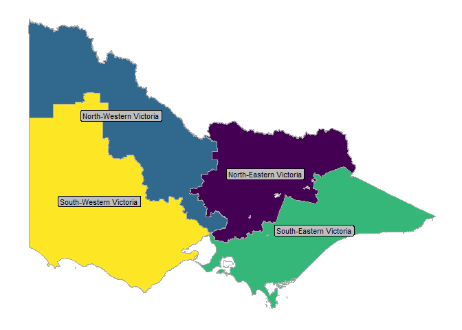
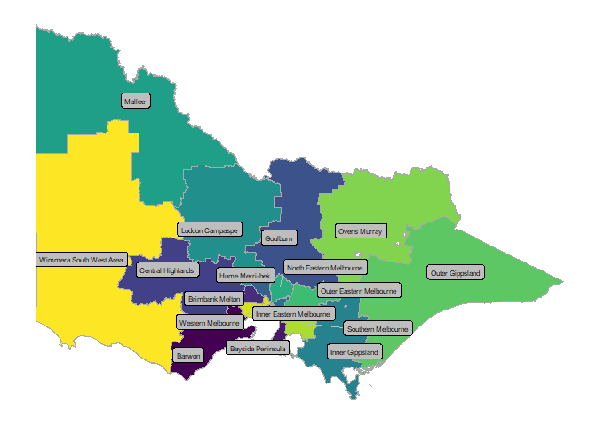

<!-- README.md is generated from README.Rmd. Please edit that file -->

# vicedumap

<!-- badges: start -->
<!-- badges: end -->

Vicedumap is a simple package containing sf objects for the Victorian
Department of Education’s Regions and Areas.

The Department of Education has four regions and 17 areas.

Areas are groups of local government areas.

Regions groups of areas.

We have used this simple aggregation to create sf objects by summarising
objects obtains using `strayr::read_absmap("lga2021")`

## Installation

You can install the development version of vicedumap from
[GitHub](https://github.com/) with:

``` r
# install.packages("devtools")
devtools::install_github("zerogetsamgow/vicedumap")
```

## region_map

The following plot shows a map of the four regions which are contained
in `vicedumap::area_map`.

``` r
library(vicedumap)
library(tidyverse)
#> ── Attaching core tidyverse packages ───────── tidyverse 2.0.0 ──
#> ✔ dplyr     1.1.4     ✔ readr     2.1.5
#> ✔ forcats   1.0.0     ✔ stringr   1.5.1
#> ✔ ggplot2   3.5.1     ✔ tibble    3.2.1
#> ✔ lubridate 1.9.3     ✔ tidyr     1.3.1
#> ✔ purrr     1.0.2     
#> ── Conflicts ─────────────────────────── tidyverse_conflicts() ──
#> ✖ dplyr::filter() masks stats::filter()
#> ✖ dplyr::lag()    masks stats::lag()
#> ℹ Use the conflicted package (<http://conflicted.r-lib.org/>) to force all conflicts to become errors
## basic region_map
ggplot(
  region_map,
  aes(geometry = geometry,
  fill = region_name)
  ) +
geom_sf()+
ggthemes::theme_map()+
theme(
  legend.position.inside = c(.7,.7)
  )
```



## area_map

The following plot shows a map of the 17 areas which are contained in
`vicedumap::area_map`

``` r
## basic area_map
ggplot(
  area_map,
  aes(geometry = geometry,
  fill = area_name)
  ) +
geom_sf()+
ggthemes::theme_map()+
theme(
  legend.position = "right",
  legend.justification = "centre"
  )
```



## region_tbl

The package contains a third dataset `vicedumap::region_tbl` which shows
the mapping of local government areas, to areas, to regions

``` r
## print full table of regions, areas and lgas
knitr::kable(
  region_tbl
)
```

| region_name            | area_name               | lga_name             |
|:-----------------------|:------------------------|:---------------------|
| North-Eastern Victoria | Inner Eastern Melbourne | Boroondara           |
| North-Eastern Victoria | Inner Eastern Melbourne | Manningham           |
| North-Eastern Victoria | Inner Eastern Melbourne | Monash               |
| North-Eastern Victoria | Inner Eastern Melbourne | Whitehorse           |
| North-Eastern Victoria | Outer Eastern Melbourne | Knox                 |
| North-Eastern Victoria | Outer Eastern Melbourne | Maroondah            |
| North-Eastern Victoria | Outer Eastern Melbourne | Yarra Ranges         |
| North-Eastern Victoria | Goulburn                | Greater Shepparton   |
| North-Eastern Victoria | Goulburn                | Mitchell             |
| North-Eastern Victoria | Goulburn                | Moira                |
| North-Eastern Victoria | Goulburn                | Murrindindi          |
| North-Eastern Victoria | Goulburn                | Strathbogie          |
| North-Eastern Victoria | Ovens Murray            | Alpine               |
| North-Eastern Victoria | Ovens Murray            | Benalla              |
| North-Eastern Victoria | Ovens Murray            | Indigo               |
| North-Eastern Victoria | Ovens Murray            | Mansfield            |
| North-Eastern Victoria | Ovens Murray            | Towong               |
| North-Eastern Victoria | Ovens Murray            | Wangaratta           |
| North-Eastern Victoria | Ovens Murray            | Wodonga              |
| North-Western Victoria | North Eastern Melbourne | Banyule              |
| North-Western Victoria | North Eastern Melbourne | Darebin              |
| North-Western Victoria | North Eastern Melbourne | Nillumbik            |
| North-Western Victoria | North Eastern Melbourne | Whittlesea           |
| North-Western Victoria | North Eastern Melbourne | Yarra                |
| North-Western Victoria | Hume Merri-bek          | Hume                 |
| North-Western Victoria | Hume Merri-bek          | Merri-bek            |
| North-Western Victoria | Loddon Campaspe         | Campaspe             |
| North-Western Victoria | Loddon Campaspe         | Central Goldfields   |
| North-Western Victoria | Loddon Campaspe         | Greater Bendigo      |
| North-Western Victoria | Loddon Campaspe         | Loddon               |
| North-Western Victoria | Loddon Campaspe         | Macedon Ranges       |
| North-Western Victoria | Loddon Campaspe         | Mount Alexander      |
| North-Western Victoria | Mallee                  | Buloke               |
| North-Western Victoria | Mallee                  | Gannawarra           |
| North-Western Victoria | Mallee                  | Mildura              |
| North-Western Victoria | Mallee                  | Swan Hill            |
| South-Eastern Victoria | Southern Melbourne      | Cardinia             |
| South-Eastern Victoria | Southern Melbourne      | Casey                |
| South-Eastern Victoria | Southern Melbourne      | Greater Dandenong    |
| South-Eastern Victoria | Bayside Peninsula       | Bayside              |
| South-Eastern Victoria | Bayside Peninsula       | Frankston            |
| South-Eastern Victoria | Bayside Peninsula       | Glen Eira            |
| South-Eastern Victoria | Bayside Peninsula       | Kingston             |
| South-Eastern Victoria | Bayside Peninsula       | Mornington Peninsula |
| South-Eastern Victoria | Bayside Peninsula       | Port Phillip         |
| South-Eastern Victoria | Bayside Peninsula       | Stonnington          |
| South-Eastern Victoria | Inner Gippsland         | Bass Coast           |
| South-Eastern Victoria | Inner Gippsland         | Baw Baw              |
| South-Eastern Victoria | Inner Gippsland         | Latrobe              |
| South-Eastern Victoria | Inner Gippsland         | South Gippsland      |
| South-Eastern Victoria | Outer Gippsland         | East Gippsland       |
| South-Eastern Victoria | Outer Gippsland         | Wellington           |
| South-Western Victoria | Western Melbourne       | Hobsons Bay          |
| South-Western Victoria | Western Melbourne       | Maribyrnong          |
| South-Western Victoria | Western Melbourne       | Melbourne            |
| South-Western Victoria | Western Melbourne       | Moonee Valley        |
| South-Western Victoria | Western Melbourne       | Wyndham              |
| South-Western Victoria | Brimbank Melton         | Brimbank             |
| South-Western Victoria | Brimbank Melton         | Melton               |
| South-Western Victoria | Central Highlands       | Ararat               |
| South-Western Victoria | Central Highlands       | Ballarat             |
| South-Western Victoria | Central Highlands       | Golden Plains        |
| South-Western Victoria | Central Highlands       | Hepburn              |
| South-Western Victoria | Central Highlands       | Moorabool            |
| South-Western Victoria | Central Highlands       | Pyrenees             |
| South-Western Victoria | Barwon                  | Colac Otway          |
| South-Western Victoria | Barwon                  | Greater Geelong      |
| South-Western Victoria | Barwon                  | Queenscliffe         |
| South-Western Victoria | Barwon                  | Surf Coast           |
| South-Western Victoria | Wimmera South West Area | Corangamite          |
| South-Western Victoria | Wimmera South West Area | Glenelg              |
| South-Western Victoria | Wimmera South West Area | Hindmarsh            |
| South-Western Victoria | Wimmera South West Area | Horsham              |
| South-Western Victoria | Wimmera South West Area | Moyne                |
| South-Western Victoria | Wimmera South West Area | Northern Grampians   |
| South-Western Victoria | Wimmera South West Area | Southern Grampians   |
| South-Western Victoria | Wimmera South West Area | Warrnambool          |
| South-Western Victoria | Wimmera South West Area | West Wimmera         |
| South-Western Victoria | Wimmera South West Area | Yarriambiack         |
